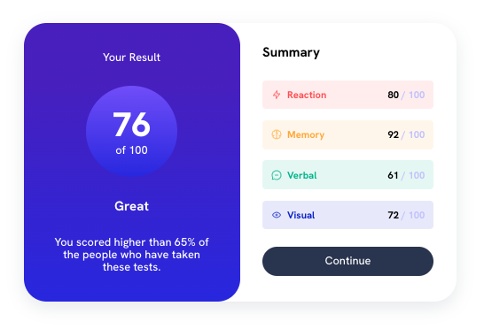

# Frontend Mentor - Results summary component solution

This is a solution to the [Results summary component challenge on Frontend Mentor](https://www.frontendmentor.io/challenges/results-summary-component-CE_K6s0maV).

## Table of contents

- [Overview](#overview)
  - [The challenge](#the-challenge)
  - [Screenshot](#screenshot)
  - [Links](#links)
- [My process](#my-process)
  - [Built with](#built-with)
  - [What I learned](#what-i-learned)
  - [Continued development](#continued-development)
  - [Useful resources](#useful-resources)
- [Author](#author)
- [Acknowledgments](#acknowledgments)

## Overview

### The challenge

Users should be able to:

- View the optimal layout for the interface depending on their device's screen size
- See hover and focus states for all interactive elements on the page

### Screenshot

### Links

- Solution URL: [Add solution URL here](https://github.com/NatnaelSisay/results-summary-component-main)
- Live Site URL: [Netlify-deploy](https://beautiful-gecko-d7e083.netlify.app)

## My process

### Built with

- Semantic HTML5 markup
- CSS custom properties
- Flexbox
- CSS Grid
- Mobile-first workflow

### What I learned

Structure the HTML form from the desktop and start with the mobile first approach.

### Continued development

I really want to understand how to make the best CSS structure and naming in combination
with the HTML structuring and class naming that will enable me to extend it to large project.
From what i see we can make small projects with simple CSS and it workds fine but as the project get bigger and bigger managing css will become issue.

### Useful resources

- [CSS Scan](https://getcssscan.com/css-box-shadow-examples) - This helped me for setting up box shadow with just a click.
- [Josh Comeau](https://www.joshwcomeau.com/css/custom-css-reset/) - The perfect place for CSS Rest.

## Author

- LinkedIn - [Natnael Kagnaw](https://www.linkedin.com/in/natnael-kagnaw/)
- Frontend Mentor - [@@NatnaelSisay](https://www.frontendmentor.io/profile/NatnaelSisay)

## Acknowledgments

I want to thank Frontend Mentor for this question.
